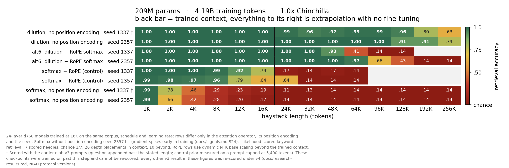
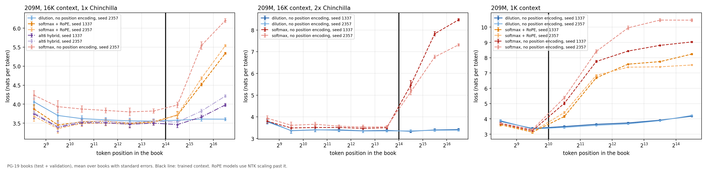

# DilutionAttention

[](https://github.com/Royer-Research-Labs/Dilution-Attention/actions/workflows/tests.yml)

A causal attention operator with **no learnable parameters**, in which each
query's claim on a key is divided by the demand that key has already received
from earlier queries. It trains at the same complexity class as softmax
attention, and models built from it retrieve far past the context they were
trained on.



*209M parameters, 16K training context, Chinchilla-matched tokens, two seeds per model. Every
row shares the architecture, corpus, schedule and learning rate, and differs only in the
attention operator, its position encoding and the seed. With **no position encoding at all**,
the all-dilution model holds 0.91-1.00 retrieval out to 128K in both seeds, eight times its
training context, with no scaling rule and no fine-tuning. Then it degrades gradually
(0.80-0.91 at 12x, 0.63-0.79 at 16x). **Softmax with no position encoding, trained
identically, reaches 0.17-0.19 at its own trained context and chance beyond it**, so the
extrapolation comes from the operator and not from the absence of rotation
([S17](docs/signals.md), [S24](docs/signals.md)). Its loss trails dilution's by 0.156 nats on
the seed that trained stably. The other softmax seed hit gradient spikes at the same learning
rate and trails by 0.24, while the two dilution seeds agree to 0.002.*

**Loss is reproducible across seeds; extrapolation range is not.** Trained on to 2x
Chinchilla, both dilution seeds improve loss identically (2.857 / 2.854) and keep in-context
retrieval. But one then reaches only about 2x (0.54 at 64K), while the other stays near-flat
(0.97 at 64K, 0.83 at 128K). The same holds at 1K context (perfect to 4x in one seed, 8x in the
other) and at 64M, where retrieval itself formed in only two of three seeds without position
encoding. RoPE on alternate layers made it form in all three ([S23](docs/signals.md),
[S24](docs/signals.md)). Every seed is shown:
[2x](docs/figures/retrieval-209m-2x.png) · [1K context](docs/figures/retrieval-209m-1k.png) ·
[64M](docs/figures/retrieval-64m-1x.png).

## The operator

```
p         = causal_softmax(q k^T / sqrt(d))     # bids
committed = exclusive_cumsum_cols(p)            # taken by earlier queries
share     = p / (committed + p + eps)           # my bid vs cumulative demand
A         = share / rowsum(share);   out = A @ v
```

The authoritative definition is the fp32 reference
[`dilution.kernels.dilution_attention_reference`](src/dilution/kernels.py#L40); the fused
Triton kernels are tested against it for forward, backward, prefill and cached decoding
(`tests/test_kernels.py`).

**In plain terms.** Standard attention lets every token shop independently:
each one spends a fixed budget of attention across the tokens behind it, and a
popular token can be bought by everybody at no extra cost. Nothing tracks that
it is being over-used.

Dilution adds a price. Each token still places its bids the usual way, with a
softmax. But before a bid is honoured it is divided by how much demand that
target has already received from every earlier token. A target nobody has
wanted yet is cheap, so a bid on it counts in full. A target that half the
sequence has already claimed is expensive, and the same bid buys a much smaller
share of it. Each token's shares are then renormalised so they still sum to
one, which keeps the operator a proper weighted average.

What the trained models show, without claiming the mechanism: in the layers
measured, dilution strongly suppresses the attention sink. No sampled dilution
layer put more than about 3% of its attention on the first token, while sampled
softmax layers put up to three quarters there. At depth, dilution spreads its
load more evenly across keys while each query stays about as selective as under
softmax ([details](docs/research-results.md#attention-structure)). Dilution also
trains with no position encoding at all, since the running demand total depends
on the order queries arrive in, and such a model keeps retrieving eight times
further out than it was trained to look. Why it extrapolates is not established:
a plausible reason is that the demand total carries no distance scale, but that
has not been tested causally.

One softmax, one cumulative sum, one renormalise: O(T^2), the same complexity
class as standard attention, with nothing learned inside the operator. Cached
decoding needs the ordinary KV cache plus one fp32 accumulator per key and head.
Derivation: [docs/operator.md](docs/operator.md).

## What the evidence says

209M parameters, 16K context, Chinchilla-matched tokens, two seeds per arm:

| arm | val loss (seed 1337 / 2357) | NIAH at 16K | retrieval beyond 16K | tok/s |
|---|---:|---:|---|---:|
| alt6: dilution + RoPE softmax, alternating | **3.0385 / 3.0399** | 1.00 / 1.00 | to 3x-4x with NTK scaling (0.66 at 6x in one seed) | 44.0K |
| all-dilution, no position encoding | 3.0569 / 3.0548 | 1.00 / 1.00 | **to 8x in both seeds** (2x-8x after 2x Chinchilla) | 33.4K |
| softmax + RoPE (control) | 3.0883 / 3.0787 | 0.79 / 0.64 | to 1.5x in one seed with NTK scaling (0.64) | **71.9K** |
| softmax, no position encoding (control) | 3.2118 / 3.2907* | 0.19 / 0.17 | chance | 74.7K |

Validation loss on one common slice. NIAH is keyword retrieval with chance 1/7 = 0.14.
\*This seed hit gradient spikes early in training and never recovered the difference (S24).
Throughput is the logged training rate on an RTX PRO 6000.

1. **Length generalisation is the durable result, and it comes from the operator.**
   With no position encoding on either side, at the same data, schedule and
   learning rate, dilution retrieves 1.00 across its 16K context and 0.91-1.00
   out to 8x beyond it in both seeds, while softmax reaches 0.17-0.19 at its own
   trained context and chance past it. Dilution with no position encoding also beats
   softmax *with* RoPE on loss. No tested softmax configuration sustains strong
   retrieval far beyond its training context: the 16K-trained controls are at
   chance by 2x (one softmax + RoPE seed holds 0.64 at 1.5x with NTK scaling),
   and the 1K-trained controls keep partial retrieval near 2x (0.56 / 0.39
   without position encoding; one RoPE seed 0.29-0.33 to about 3.75x with NTK
   scaling) before degrading. The RoPE-bearing dilution and hybrid
   configurations tested also degrade eventually; NTK scaling extends some of
   them but does not remove the degradation. Pure dilution with no position
   encoding produced the longest extrapolation observed
   ([S12-S17, S21, S24](docs/signals.md)). The same holds for loss on long real
   books (PG-19): past the trained context the 16K dilution models' loss stays
   flat to 8x, while softmax + RoPE with NTK scaling ends up 1.7-1.9 nats worse
   than dilution at 8x and softmax without position encoding 2.6-5.1 worse
   ([S27](docs/signals.md)):

   
2. **Extrapolation range varies by seed, and loss does not show it.** Dilution's
   loss replicates closely (seeds agree to within about 0.007 nats in every cell
   measured, 0.002-0.004 at 209M), but how far its retrieval reaches does not:
   2x-8x at 64M among seeds that retrieve at all, 4x-8x
   at 1K context, 2x-8x after 2x Chinchilla at 209M. The 209M 1x checkpoints are
   the most consistent (flat to 8x in both seeds). Report extrapolation as a range
   over seeds ([S22-S24](docs/signals.md)).
3. **The loss margin is small once positions are controlled.** Earlier ladders
   compared learned-position softmax against dilution and reported 0.19-0.43
   nats. Giving softmax RoPE closes most of that. The margin grows with context:
   softmax + RoPE is *ahead* by 0.036 at 1K (209M, two seeds). The two are roughly
   level at 8K (0.006, 64M), and dilution leads by 0.03-0.09 at 16K (0.028 for
   dilution without position encoding and 0.044 for alt6 at 209M; 0.077-0.092 at 64M
   over three seeds) ([S5-S9, S11, S21-S24](docs/signals.md)). Those margins are
   on in-domain validation text. On out-of-domain long books (PG-19), inside the
   trained context dilution trails softmax + RoPE by 0.05-0.08 nats at 16K and
   0.18-0.24 at 1K ([S27](docs/signals.md)).
4. **Position encoding matters more than the operator for loss, and the
   operator matters more for retrieval.** RoPE on every layer destroys
   dilution's retrieval. RoPE on alternate layers starting with the first is its
   best mode at 64M: the best loss, and retrieval that forms in every seed, with a
   reach that varies by seed (with NTK scaling 0.41-0.94 at 4x, and one seed still
   0.80 at 6x). The hybrid that gives each operator its best position mode is the
   strongest cell at 8K on every axis ([S5-S9, S23](docs/signals.md)).
5. **Loss does not predict retrieval.** At 64M, two seeds of the same recipe
   reach the same loss to 0.0004, yet one retrieves 0.97 at 16K and the other
   0.19. The failed seeds never grow the strong retrieval head (50-75% of one head's
   attention on the answer) that healthy seeds have in layers 6-9. One run at
   learning rate 6e-4 improved loss by 0.08 nats and retrieved at chance; with
   one seed, and retrieval failing in one of three seeds at 3e-4 and at 1.5e-4,
   that cannot be separated from the seed lottery ([S15, S22, S23](docs/signals.md)).
6. **Softmax bids work best of those tested.** Of the bids tried, only softmax and
   sigmoid train with the share step. The share step's gradient scales as
   1/bid, and bids whose Jacobian lacks a factor of the bid (relu, relu2,
   minshift) diverge, as that predicts. Softplus also diverged, but its
   Jacobian does carry the factor, so its failure is measured rather than
   explained (possibly numerical). Raw exponential bids overflowed fp32 in our
   implementation; a stable form is untested ([S3, S4](docs/signals.md)).
7. **Attention structure.** In the layers measured (first, middle and last, one
   1,024-token window per model), dilution strongly suppresses the token-0
   attention sink: no sampled dilution layer puts more than 0.028 of its
   attention there, against 0.14-0.75 for 209M softmax with no position encoding
   and 0.25-0.32 with RoPE. At depth its key load is less concentrated than
   softmax's for similar per-query selectivity. Neither statistic tracks
   extrapolation range, and these are snapshots, not a causal account
   ([S20](docs/signals.md)). Against its closest published precedent, temporal
   attention, the exclusive denominator is degenerate in causal self-attention: a
   key's first visible query is itself, where prior demand is zero, so that entry
   wins its row by 1/eps. A model trained that way loses its entire first layer
   to an identity map and, against inclusive dilution trained with the same
   recipe, 0.072 nats, with retrieval at 7.9K falling from 1.00 to 0.62, no better
   than the no-cumsum control (one seed each, [S18](docs/signals.md)).
8. **Generated text.** The 209M models were also made to write: 256-token
   continuations of the same validation prompts, judged by a larger model
   (SmolLM2-1.7B, bits per byte; lower is more natural). Inside the trained
   context, sample quality tracks loss: dilution is level with softmax + RoPE
   at 16K, better than softmax without position encoding, and slightly behind
   softmax + RoPE at 1K, where softmax has the better loss. Past the trained
   context, all the softmax models tested here write incoherent text at 2x-4x
   (1.9-3.3 bits per byte, against about 1.1 in context), while dilution's
   samples stay within 0.06 of their in-context quality. The judge sees only the
   last 4,096 tokens of each prompt, so this shows that dilution remains a
   working language model past its trained window, not that it uses information
   from 32K tokens back ([S25](docs/signals.md)). Judge bits per byte under
   nucleus sampling ("a / b" is two seeds; bold is dilution past its trained
   context):

   | 209M models | inside the trained context | 2x past it | 4x past it |
   |---|---|---|---|
   | *16K, 1x Chinchilla:* dilution, no position encoding (one seed) | 1.09-1.13 | **1.14** | |
   | softmax + RoPE | 1.09-1.15 | 1.87 / 2.15 | |
   | alt6 hybrid | 1.06-1.10 | 1.20 / 1.20 | |
   | *16K, 2x Chinchilla:* dilution, no position encoding | 1.00-1.04 | **1.00 / 1.02** | |
   | softmax, no position encoding | 1.05-1.14 | 3.33 / 2.31 | |
   | *1K context:* dilution, no position encoding | 1.07-1.10 | **1.12 / 1.11** | **1.16 / 1.13** |
   | softmax + RoPE | 1.05-1.09 | 2.45 / 2.58 | 2.97 / 2.62 |
   | softmax, no position encoding | 1.07-1.10 | 2.26 / 2.37 | 2.25 / 2.77 |
   | the human continuation | 0.65-0.70 | | |

Further reading: [docs/research-results.md](docs/research-results.md) (concise findings, setup
and every results table), [docs/signals.md](docs/signals.md) (the evidence ledger),
[docs/related-work.md](docs/related-work.md) (literature position and contribution boundary),
[docs/reproducing.md](docs/reproducing.md) (data, evaluation protocols and retraining).

## Kernels

The operator has a prefix dependence down each key column, so a standard fused
attention kernel cannot express it as a score modifier. The Triton
implementation uses online softmax statistics, tiled recomputation, query-block
carry checkpoints, a reverse suffix recurrence in the backward, and an O(T)
decode accumulator.

Forward plus backward, bf16, RTX PRO 6000 ([S26](docs/signals.md)): **5.46 ms at B8 H8 T4096, 5.05 ms
at B2 H8 T8192, and 30.2 ms at the 209M training shape B2 H12 T16384**. A 256K forward runs in
17.9 GiB. Softmax trains 1.3x faster than dilution at 1K context and 2.2x faster at 16K. The
heaviest backward pass is limited by latency at the register ceiling, and the levers reachable
from Triton have been measured; further gains need a lower-level implementation. Design and
measurements: [docs/kernels.md](docs/kernels.md).

## Getting started

Python 3.10+ and PyTorch 2.4+ with CUDA and Triton for the fused kernels (the reference path
runs on CPU).

```bash
pip install -e ".[dev,data,figures]"
pytest                                          # CPU tests + CUDA-gated kernel parity
python -m dilution.train --config configs/smoke.yaml --overwrite-run   # synthetic-data smoke run
```

- **Data.** `dilution-prepare-data` rebuilds the three FineWeb-Edu corpora exactly, and every
  run record stores the SHA-256 of the corpus it trained on.
- **Retrieval.** `dilution-niah` runs the NIAH harness
  ([Royer-Research-Labs/Niah](https://github.com/Royer-Research-Labs/Niah), pinned at `7cbf29f`).
- **Long-document perplexity.** `scripts/long_perplexity.py` (PG-19 books).
- **Sampling.** `scripts/sample_eval.py` (`pip install -e ".[sampling]"`);
  `scripts/verify_samples.py` recomputes every published sampling statistic from the shipped
  per-sample metrics.
- **Weights.** The 16 209M models behind the results are on Hugging Face
  ([Royer-Research-Labs](https://huggingface.co/Royer-Research-Labs)); `dilution.hub.from_pretrained("Royer-Research-Labs/<model>")`
  loads one (`pip install -e ".[hub]"`).
- **Retraining.** Configs are under `configs/`, run records (metrics, resolved config, data
  provenance; no training checkpoints) under `runs/`, evaluation outputs under `results/`, and
  `scripts/make_retrieval_figure.py` regenerates the figures.

Commands, the evaluation protocols and their caveats are in
[docs/reproducing.md](docs/reproducing.md).

## Open questions

- **What sets extrapolation range after long training.** At 2x Chinchilla one
  209M seed kept near-flat retrieval to 8x and the other fell to ~2x, at the same
  loss ([S24](docs/signals.md)). Extrapolation range, like 64M retrieval itself
  ([S23](docs/signals.md)), varies by seed in ways loss does not show.
- **In-context loss out of domain.** On long out-of-domain books dilution trails
  softmax + RoPE inside the trained context (0.05-0.08 nats at 16K, 0.18-0.24 at
  1K), most at the start of each document, although it is level or ahead on
  in-domain text ([S27](docs/signals.md)). Why is open.
- **Broader retrieval validation.** NIAH here is likelihood-scored keyword
  retrieval over 7 scored needles per length (chance 1/7), not long-context
  reasoning. Generation is tested for local fluency only ([S25](docs/signals.md));
  whether generated text stays consistent with information far back in a long
  prompt, and retrieval by generation, are untested. The capability claim should
  not be read wider.
- **The rest of the temporal-attention factorial.** Row-normalised bids with
  exclusive history are measured against dilution with the same recipe, one seed
  each ([S18](docs/signals.md)). The raw-exponential cells are not: our fp32
  version overflowed, and the numerically stable cumulative-logsumexp form
  ([docs/related-work.md](docs/related-work.md)) has not been built.
- **Why retrieval sometimes fails to form at 64M.** With no position encoding,
  two of six 64M dilution seeds never learned in-context retrieval, at the same
  loss as the seeds that did. The failed seeds lack the strong retrieval head that
  the healthy seeds grow in layers 6-9. A Wikipedia-heavy blend did not change the
  odds ([S22](docs/signals.md)), nor did halving the learning rate. RoPE on
  alternate layers fixes it ([S23](docs/signals.md)). What makes the head form at
  all is open.
- **Hybrids with token-local mixers** such as
  [TriGLU](https://github.com/Royer-Research-Labs/TriGLU): early exploratory runs
  mixing a few dilution layers into a token-local stack were suggestive but used
  learned position encodings and were not re-run with modern controls, so they are
  not part of this release's claims.
- **Throughput.** Dilution trains at 0.45x softmax's rate at 16K and 0.77x at 1K.
  alt6 recovers most of that while keeping in-context retrieval, but not the full
  extrapolation. A lower-level backward kernel is the open lever
  ([docs/kernels.md](docs/kernels.md)).

## Contributing

This is research code released with the evidence behind it. Issues and pull requests are welcome,
especially reproductions, failed replications and bug reports; there is no support guarantee.
